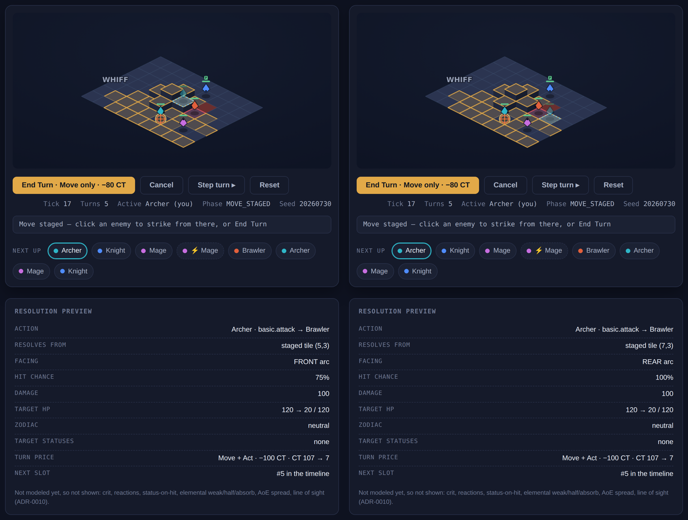
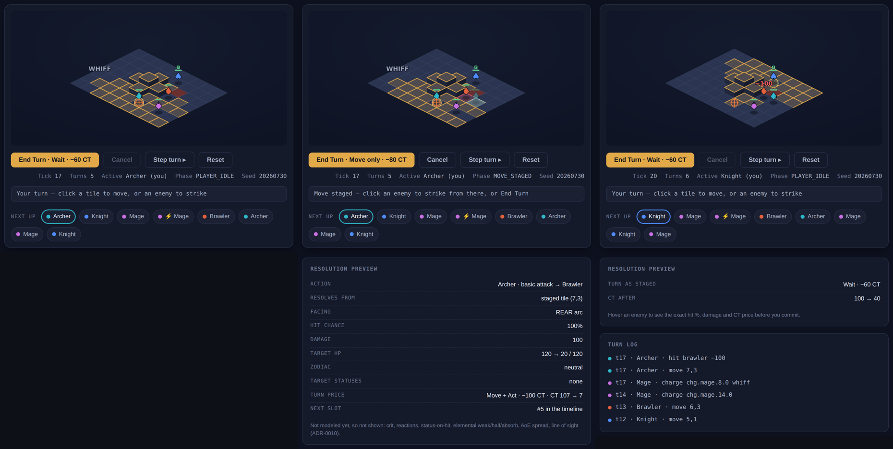

# Visual proof — the playable viewer (click-to-act)

The viewer stops being watch-only. The player drives **team 0**: click a highlighted tile
to *stage* a move, click an in-range enemy to *commit* the whole turn as **one folded
command** (ADR-0015). Team 1 stays AI.

Every frame below is captured by a Playwright test that **asserts the claim in the same
test that takes the shot** — the images are test output, not screenshots taken by hand.

---

## The argument, in two stills

Same Archer. Same Brawler. Same ability, same damage, same **−100 CT** price. The *only*
difference is which tile the move was staged to — and that flips the attack from the
target's **front** arc to its **rear**:

| staged tile | arc | hit chance |
|---|---|---|
| (5,3) | FRONT | **75%** |
| (7,3) | REAR | **100%** |

This is the whole reason move-then-act had to become expressible. A preview computed from
the actor's *origin* tile would read **SIDE / 100% for both** — which is why the e2e test
asserts that both facings differ, both hit percentages differ, **and** that neither reads
`side`. A stale-origin preview then fails on both stagings, not just the one whose number
happens to move.

Note the footer of the preview card: *"Not modeled yet, so not shown: crit, reactions,
status-on-hit, elemental weak/half/absorb, AoE spread, line of sight (ADR-0010)."*
Unmodeled rows are **absent, never displayed as zero** — printing "Crit 0%" would assert a
modeled zero the engine cannot back up (`docs/10` §4, pillar 4).

---

## The fold, end to end

1. **`PLAYER_IDLE`** — the Archer's real `moveRange` painted in gold, the one reachable
   enemy tinted red, `End Turn · Wait · −60 CT`.
2. **`MOVE_STAGED`** — the ghost sits on (7,3) and the preview resolves *from there*:
   `REAR arc · 100% · 100 damage · 120 → 20 HP · Move + Act · −100 CT · CT 107 → 7`.
   Nothing has touched the sim yet.
3. **Committed** — the `−100` popup lands, `Turns` ticks to 6, and the **turn log is the
   proof**: `t17 · Archer · hit brawler −100` and `t17 · Archer · move 7,3` are at the
   **same tick**. One turn, one command, one settle — not a move turn followed by an
   attack turn.

Before this slice that turn was **unreachable**: every driver branch settled immediately,
so `{didMove:true, didAct:true}` — and the −100 row of `docs/01`'s CT table — could not be
produced by any replay-legal command log.

---

## Frames

| file | what it shows |
|---|---|
| `10-player-turn.png` | Player turn: gold move range, reachable enemy tinted, priced End Turn button |
| `11-preview-a.png` | Staged (5,3) → FRONT arc, 75% |
| `12-preview-b.png` | Staged (7,3) → REAR arc, 100% |
| `13-illegal.png` | An illegal click: red *Out of Move range* chip, board unchanged |
| `14-committed.png` | After the fold: damage popup, HP bar dropped, timeline reordered, log showing both entries at one tick |
| `15-ai-turn.png` | AI turn: dashed ring, End Turn disabled, input inert |
| `01-initial.png`, `04-aftermath.png` | Re-shot opening and terminal board |
| `preview-pair.png`, `fold-filmstrip.png` | The composed arguments above |
| `run-filmstrip.png` | Tiled contact sheet of the recorded run |
| `run.mp4`, `run.gif` | Motion, for desktop viewers |

**On formats:** the GitHub **mobile app** displays no motion format for a private repo —
it does not inline images, has no player for a committed video, and will not animate a
GIF. Static images via tap-through are the only medium it shows, which is why the
argument above is carried by `preview-pair.png` and `fold-filmstrip.png` rather than by
`run.mp4`. Playable video lives on the Pages gallery (`/visual/`) after merge.

---

## Two honest limitations in these frames

- **`13-illegal.png` only proves "nothing changed" when compared against `10`.** On its
  own it just shows a red chip. The *test* carries that claim properly: it asserts the
  canonical save string — the exact bytes a mid-battle save writes — is byte-identical
  across the refused click.
- **The board reads small.** The 9×7 grid spans roughly x 194–706 of a 900-wide canvas,
  so there is dead horizontal space. Cropping tighter would push the End Turn button out
  of frame, and that button's stated CT price is part of the proof — so the frames keep it.

## What is deliberately NOT here

The demo's old **Slow** chip is gone, and no debuff appears in any frame. It was
render-layer fiction: `demo.ts` applied Slow directly because the sim's inflict-on-hit
resolution is deferred (ADR-0010). A viewer routing everything through the sim cannot
show it without asserting a status the sim never inflicted. The Knight's construction-time
**Protect** buff survives and is still visible. The debuff render path is consequently
unexercised until status infliction lands.
