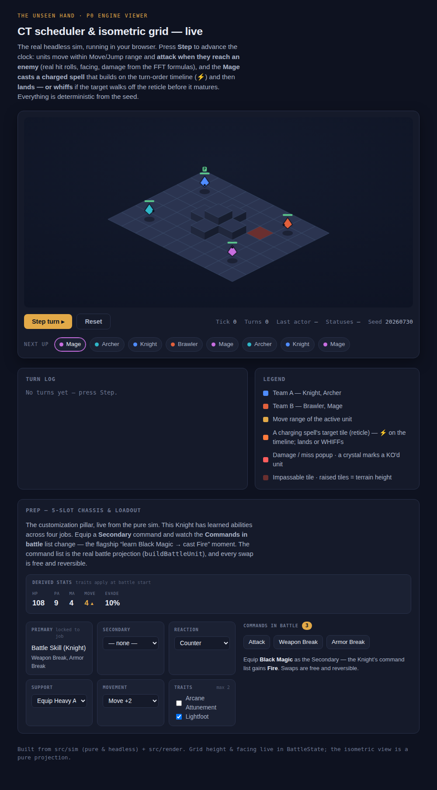
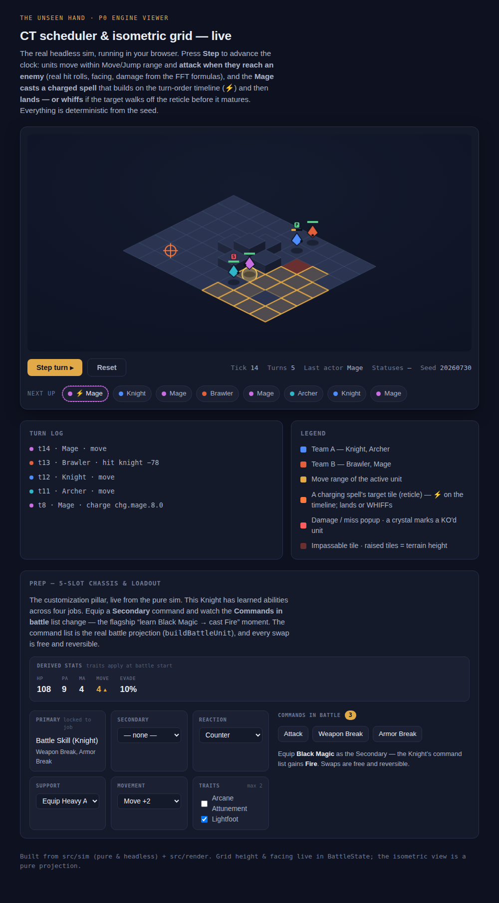
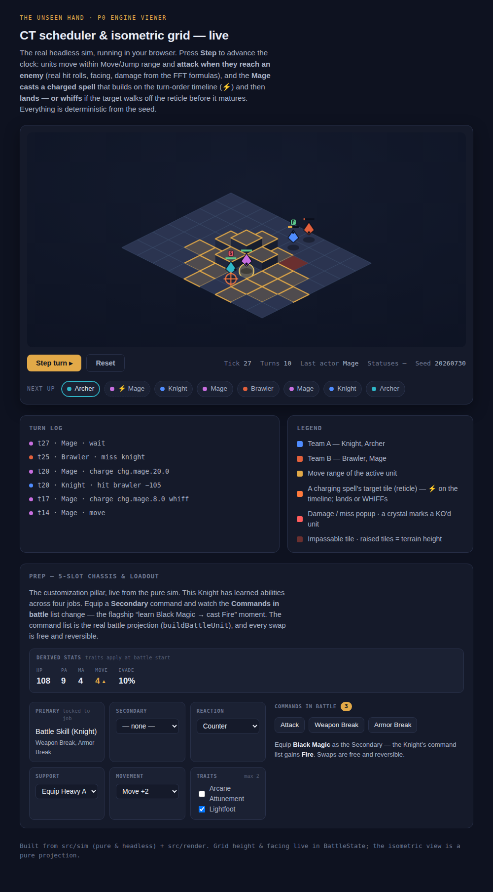

# Status badges — viewer visual proof

Committed frames + video for the "render status effects as buff/debuff badges"
slice (PR #18). Regenerated deterministically by `npm run test:visual` /
`npm run gallery`; these are the same frames the visual-tests CI job uploads and
that deploy to the GitHub Pages gallery (`/visual/`) on merge.

## Protect (buff) — green `P` on the Knight (opening frame)

## Protect + Slow — green `P` on the Knight, red `S` on the Archer (turn 5)

Both badges sit above the HP bars, clear of the charge reticle and the
move-range highlight.

## Combat frame

## Video (stepped run)

Three formats, because each viewing surface needs a different one:

- [`run.gif`](run.gif) — animates as an image, including via tap-through in the
  GitHub **mobile app** (whose blob viewer has no player for committed videos).
- [`run.mp4`](run.mp4) — H.264, for desktop browsers and downloads.
- [`run.webm`](run.webm) — the Playwright-native capture (does not play on mobile).
