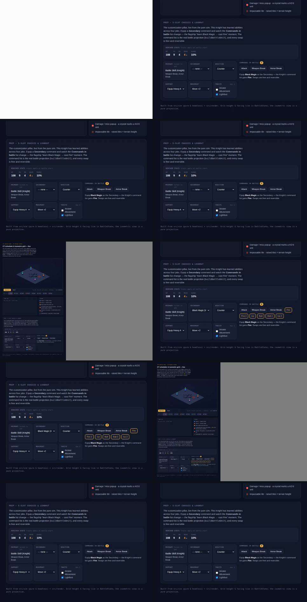

# Status badges — viewer visual proof

Committed frames + video for the "render status effects as buff/debuff badges"
slice (PR #18). Regenerated deterministically by `npm run test:visual` /
`npm run gallery`; these are the same frames the visual-tests CI job uploads and
that deploy to the GitHub Pages gallery (`/visual/`) on merge.

## Protect (buff) — green `P` on the Knight (opening frame)

## Protect + Slow — green `P` on the Knight, red `S` on the Archer (turn 5)

Both badges sit above the HP bars, clear of the charge reticle and the
move-range highlight.

## Combat frame

## Stepped run — filmstrip (the mobile-readable motion format)

The GitHub **mobile app** displays no motion format for private-repo files —
no player for committed videos, and GIF tap-through does not animate (verified
on-device). Static images are the only medium it shows, so the run is also
committed as a contact sheet (10 frames, ~0.5s apart, read left-to-right):

## Motion formats (desktop)

- [`run.gif`](run.gif) — animates inline in the PR body / this README on desktop web.
- [`run.mp4`](run.mp4) — H.264, for desktop browsers and downloads.
- [`run.webm`](run.webm) — the Playwright-native capture.

After merge, the full gallery (including playable video) deploys to GitHub
Pages under `/visual/` — a plain webpage, playable in any browser.
